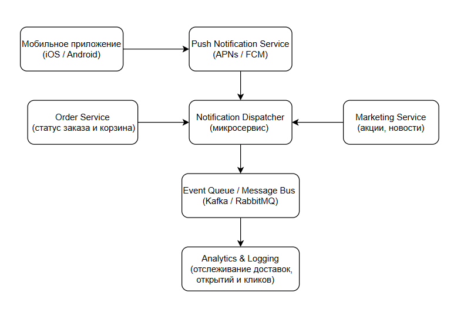

# Задание 3 - Архитектура
## Верхнеуровневая архитектурная схема PUSH-уведомлений

## Описание архитектуры системы PUSH-уведомлений для мобильного приложения интернет-магазина
В основе системы пуш-уведомлений лежит мобильное приложение интернет-магазина, которое устанавливается на устройства пользователей (iOS и Android). После установки приложение регистрируется в службе Push Notification Service - для iOS это APNs, для Android - FCM. В процессе регистрации приложение получает уникальный Device Token, который идентифицирует устройство для доставки уведомлений. Эти токены сохраняются на бэкенде, чтобы система могла точно отправлять пуши нужным пользователям.

Доставка уведомлений на устройства пользователей осуществляется через Push Notification Service. Это сторонняя платформа, которая гарантирует, что уведомления, отправленные системой, будут доставлены на устройства. Но сами уведомления формируются и управляются внутренним сервисом - Notification Dispatcher.

Notification Dispatcher - это центральный микросервис, который отвечает за подготовку, формирование и отправку пушей. Он получает события из различных микросервисов через Event Queue (шину сообщений) и формирует уведомления в нужном формате: с текстом, типом, ссылкой или deeplink. Например, если товар долго лежит в корзине без действий пользователя, если заказ отменён или появилась новая акция - Notification Dispatcher преобразует эти события в пуш и отправляет их через APNs/FCM на устройства пользователей.

События для Notification Dispatcher генерируются различными микросервисами бэкенда:

Order Service - отвечает за корзину и заказы. Он отслеживает действия пользователя: добавление товаров в корзину, оплату заказа, отмену или задержку заказа. Этот сервис генерирует события, когда, например, товар долго лежит без покупки, заказ отменён или изменился статус доставки.

Marketing Service - отвечает за акции, распродажи, рекламные рассылки и новостные уведомления. Он генерирует события о новых скидках или специальных предложениях, которые нужно отправить пользователю.

Все события передаются через Event Queue / Message Bus, например Kafka или RabbitMQ. Это асинхронная шина сообщений, которая позволяет микросервисам взаимодействовать без жёсткой связки между собой. Notification Dispatcher подписан на нужные события и получает их в реальном времени, что обеспечивает быстрое реагирование на действия пользователей.

После отправки уведомлений, вся информация о доставке, открытии пушей и кликах фиксируется в сервисе Analytics & Logging. Это позволяет анализировать эффективность уведомлений, проводить A/B тесты и оптимизировать стратегию маркетинговых и сервисных уведомлений.
